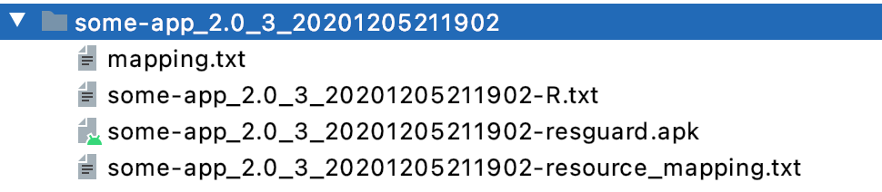
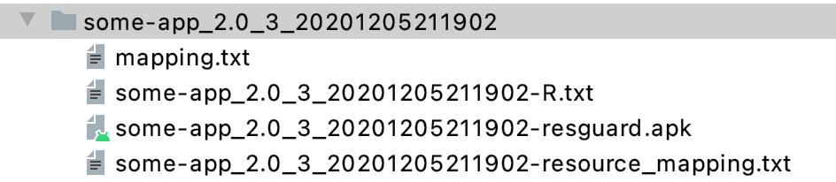
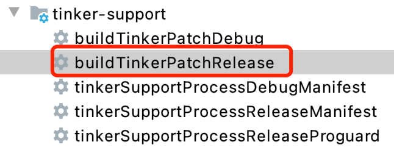
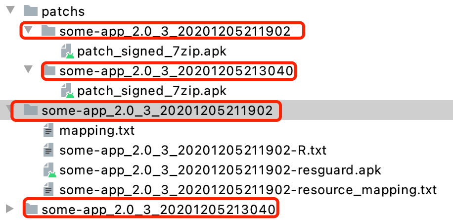
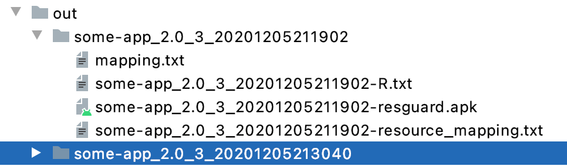
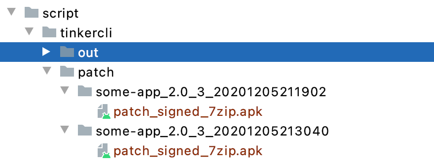

# BuglyHotfix-AndResDemo
BuglyHotfix with AndResGuard Demo

基于官方 demo 修改：[BuglyDevTeam/Bugly-Android-Demo](https://github.com/BuglyDevTeam/Bugly-Android-Demo)

## 文件说明

- source

  将官方的一些源码以及 test apk 单独存放了下来。

- script

  - andresguard-support.gradle

    腾讯 AndResGuard 资源混淆配置文件（与官方无异）

  - tinker-support.gradle

    腾讯 Bugly 热修复配置文件（与官方无异）

  - andres-tinker-support.gradle

    用于支持资源混淆的补丁生成，主要是对补丁以及路径生成等做了处理。

  - tool.gradle

    一些 task ，用于py 脚本以及混淆包生成任务。

  - tinkercli

    * tinker-patch-cli-1.9.14.9-all.jar

    * tinker-patch.py

      一个简单脚本，批量对比，批量生成补丁。（没有 Bugly 的 MF 文件，无法被 Bugly 版本管理）

- tinker-patch.py

  一个简单脚本，基于 gradle buildTinkerRelease task 批量生成补丁，由于是使用 tinker-support task，所以生成的补丁支持 Bugly 版本管理

## Tinker 与 AndResGuard 混淆配合使用说明

因使用到了AndResGuard，除了接入外需要特殊处理。主要代码块位于`andres-tinker-support.gradle`中的该部分：

```groovy
def tinkerPatchTask = project.tasks.findByName("tinkerPatch${taskName.capitalize()}")
        if (tinkerPatchTask) {
            tinkerPatchTask.doFirst {
                def buildOutDir = "${buildDir.absolutePath}/outputs/apk/${taskName}"
                def buildApkPath = "${buildOutDir}/AndResGuard_${rootProject.ext.outputFileName}/${rootProject.ext.outputFileName}_7zip_aligned_signed.apk"
                println("change tinkerPatchTask buildApkPath to resugurad output ${buildApkPath}")
                if (!"${rootProject.ext.newApk}".isEmpty()) {
                    //替换为指定 apk
                    tinkerPatchTask.buildApkPath = "${rootProject.ext.newApk}"
                } else {
                    //替换tinker release产生的apk 为res混淆后的 apk
                    tinkerPatchTask.buildApkPath = buildApkPath
                }
            }
            //region 关键代码
            tinkerPatchTask.dependsOn resGuardTask
        } else {
            println("tinkerPatchTask not found")
            return
        }
```

**原理：** 由于tinkerPatch task无法进行拆分，只能在打包时插入资源混淆的任务，在完成后将tinkerPatchTask所指向的`buildApkPath`进行变更，这样才能达到对资源混淆包的对比。

* 取消对混淆的支持

  在生成debug包补丁时不会有影响，不需要时，则注释`project.afterEvaluate`整个代码块即可。

## Tinker 批量生成补丁包制作说明

主要依赖工具：`tinker-patch-cli-1.9.14.9-all.jar`

关于该 lib 的官方说明：[命令行接入](https://www.bookstack.cn/read/tinker/spilt.3.5117b3e26a238f0c.md)

#### tinker-patch-cli编译

github官方地址下载 tinker-dev 的 release 包：

https://github.com/Tencent/tinker

使用 Android Studio 打开，编译时需要注意先对下载下来的代码进行 git 仓库初始化：

```
git init
git add .
git commit -m "init"
```

不然的话会一直停留在`Check git-diff changed files`，导致gradle无法进行初始化编译。

等待项目初始化完成后，找到`tinker-build/tinker-patch-cli/build.gradle`，在gradle中找到task `buildTinkerSdk`并运行。

```
task buildTinkerSdk(type: Copy, dependsOn: [clean, shadowJar])
```

完成后会生成到`buildSdk/build`目录。整个目录都是需要的东西。

#### tinker-patch-cli参数配置

* tinker_config.xml修改

  参数与gradle版本一致，但需要配置sign，7z压缩目录。

  代码块如下：（7z需要根据平台的不同而变更，这里是windows配置, 其他平台注释这行使用官方默认即可）

  ```xml
          <!--if you don't set sevenZip path, we just use 7za to try-->
          <sevenZipPath value="SevenZip-1.1.16-windows-x86_64.exe"/>
  ```

  ```xml
      <!--sign, if you want to sign the apk, and if you want to use 7zip, you must fill in the following data-->
      <issue id="sign">
          <!--the signature file path, in window use \, in linux use /, and the default path is the running location-->
          <path value="release.keystore"/>
          <!--storepass-->
          <storepass value="testres"/>
          <!--keypass-->
          <keypass value="testres"/>
          <!--alias-->
          <alias value="testres"/>
      </issue>
  ```

  **需要注意：**

  * 其中的`isProtectedApp`属性修改。根据使用情况的不同，需要进行不同的配置。

  * 密匙的配置不支持相对路径，所以尽量使用默认的相对路径，即放在同一目录，若密匙变更则需要一同变更。

* tinker_proguard.pro修改

  需要加入基准包的mapping混淆文件，以及其余对于混淆的要求。

  ```
  -applymapping path/to/mapping.txt 
  ```

  注：加入mapping文件步骤已在脚本中集成，无需手动处理。

#### 主要脚本tinker-patch.py说明

脚本整体比较简单，主要是四个函数：

* `get_prop`

  用于获取传参，后续需要添加参数可更改此处。

* `fetch_file`

  用于匹配mapping文件与基准包apk位置。

  若基准包目录格式更改可更改此处，目前基准包的要求为：

  

  需要用到的文件（必不可缺）：图中红框选中文件，混淆结果`mapping,txt`、混淆后的apk `some-app-resguard.apk`。

  匹配规则看代码：（项目中 apk 的生成，release 也是这个规则）

  ```python
  mapping = apk + '/mapping.txt'
  old_path = apk + '/' + base_name + '-resguard.apk'
  ```

* `release_patch`

  使用`tinker-patch-cli`命令打补丁，若后续`tinker-patch-cli`命令变更可更改此处。

* `copy_patch`

  将当前基准包在out目录生成的补丁包转移，以避免下一个基准包的补丁将其覆盖。若需要改变输出目录则更改此处。

* 其他py文件为官方提供，可自行查看，一般不需要。

## Tinker 补丁生成

为更符合业务需求，在除了编译生成补丁，还需要有更便捷的批量基于多个基准包生成补丁的方式。

* 即时编译生成方式

  * 每次只能对一个基准包进行补丁生成，且只能以当前分支的代码来进行对比生成补丁。
  * 每次都会对代码重新release混淆后才能进行对比，同一份代码可能出现每次编译dex分包均不同的情况。（会产生补丁差异）（或者指定某个固定基准包，忽略编译时生成的最新包，但编译过程却无法省略）
  * 支持 bugly 平台管理。

* `tinker-patch-cli`脚本批量方式

  * 不限制基准包版本与数量，只需要确保新包比基准包都要新即可。
  * 单纯只进行包对比，不涉及编译，速度更快，更稳定。
  * 不支持支持 bugly 平台管理。

* 其他方法1

  找到 tinker-support 插件对于 MF 文件的处理，自行在`tinker-patch-cli`的补丁生成后，使用 `jar uf`添加进补丁包。（暂未实现）

* 其他方法2

  修改 tinker 插件源码，使其不必要每次都先打包。此外目前 tinkerPatch 也不支持在 task 中连续循环执行，仅能执行一次。（暂未实现）

### 即时编译生成方式

即时编译相关配置主要在`config.gradle`中，有一些参数需要配置。

```groovy
//此处填写每次需要进行补丁构建的基准包目录
baseDir = "${rootDir}/out/some-app_2.0_3_20201205173139"
//用于指定新基准包 不使用编译时生成的基准包（tinker 每次任务都会重新生成一个）
newApk = ""
```

在正常发版release时，主要需要修改的为：`isProtectedApp`，加固包与非加固包，需要区分。

在补丁生成时，主要修改的为`baseDir`，指针对某个基准包进行补丁生成。

**基准包格式：**（需要R文件，以往包不适用）



补丁包生成涉及文件：混淆结果`mapping,txt`、混淆后的apk `some-app-resguard.apk`、以及`R.txt`

打补丁包：



运行完成，则会拷贝至`out/最新基准包版本/patch_signed_7zip.apk`


**这种方式生成的支持 Bugly 管理。**

该方式还有一个批量执行的版本，脚本在`根目录/tinker-patch.py`，主要代码：

```
def release_patch(old_path):
    if platform.system() == "Windows":
        cmd_head = "gradlew.bat"
    else:
        cmd_head = "./gradlew"
    if new_apk == '':
        patch_cmd = cmd_head + ' app:initDir -PmultiApkDir=' + old_path + ' app:buildTinkerPatchRelease'  # --info
    else:
        patch_cmd = cmd_head + ' gradlew app:initDir -PmultiApkDir=' + old_path + ' -PnewApkPath=' + new_apk + ' app:buildTinkerPatchRelease'  # --info

    print("patch_cmd: "+patch_cmd)
    
    p = subprocess.Popen(patch_cmd, shell=(platform.system() != "Windows"), stdout=subprocess.PIPE,
                         stderr=subprocess.STDOUT)
    while p.poll() is None:
        line = p.stdout.readline()
        line = line.strip()
        if line:
            print(line)
    if p.returncode == 0:
        print('Subprogram success')
    else:
        print('Subprogram failed')
    return

```

我没特意学过 py，需要什么查什么，这里存在一些问题，比如 subprocess 使用 ctrl c 无法中断。不过并不影响补丁的生成。

可以指定最新的基准包，忽略每次编译生成的包。

```py
python3 tinker-patch.py -d path/to/BuglyHotfix-AndResDemo/out -n path/to/some-app_2.0_3_last-resguard.apk
```

也可以不指定，每次和新编译生成的包对比。

```
python3 tinker-patch.py -d path/to/BuglyHotfix-AndResDemo/out 
```

运行完成会按旧基准包名称存放。



**注意：即便只有一个基准包，也需要包括在一个目录中，且基准包文件格式以及相对路径必须符合上图**（或者自行修改匹配规则）

补丁包生成涉及文件：混淆结果`mapping,txt`、混淆后的apk `some-app-resguard.apk`、以及`R.txt`

### tinker-patch-cli 脚本批量方式

脚本存放位置：项目根目录/script/tinkercli/tinker-patch.py

使用方式：

```python
python .\tinker-patch.py -d 旧基准包目录 -n 新包apk路径
```

例：

```python
python .\tinker-patch.py -d path\to\out -n path\to\new.apk
```

out目录图例：



需要用到的文件：图中红框选中文件，混淆结果`mapping,txt`、混淆后的apk `some-app-resguard.apk`。

**需要注意的是：即便只有一个基准包，也需要包括在一个目录中，且基准包文件格式以及相对路径必须符合上图。**

执行命令后，将会在`tinkercli/patch`生成对应版本的补丁包，格式如下：



生成补丁包后需进行另存管理，否则下次对同样基准包处理时将被覆盖。

**这种方式生成的不支持 Bugly 管理。**